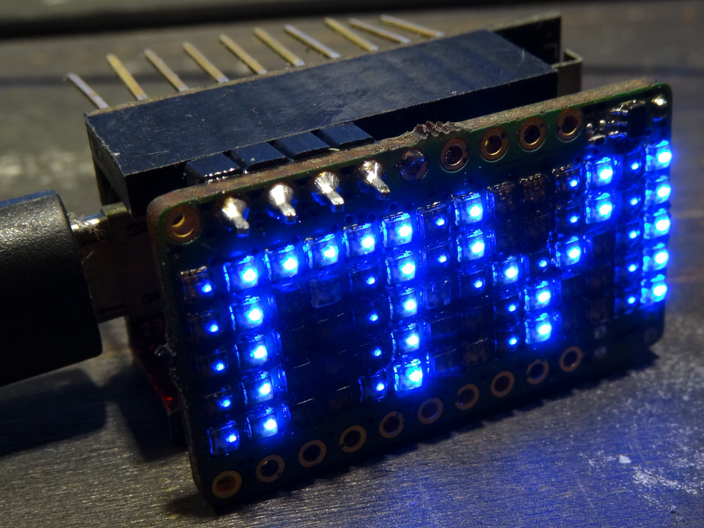

## 5*14 RGB-LED shield for tinypico esp-32 board
# General
* for use with tinypico esp32 board
** https://www.tinypico.com/
** https://github.com/tinypico 
* Uses 70 WS2812 LEDs in 151 package
* easy to use with fastLED
* integrated level-shifter for data signal 3,3V -> 5V
* integrated reset button (optional to use or populate) 
* connection to tinypico: 5V (supply for LEDs), GND, IO4 or IO25, reset (if switch is used)
** with R1 or R2 user can select to use IO4 or IO25 for the led data line   
# Images 
see also folder /images

# License 
This is based on the shield template from the orignal repository. So also the licencs is shared.  
These files are released as open source under the CERN license. Please review the license before using these files in your own projects to understand your obligations.